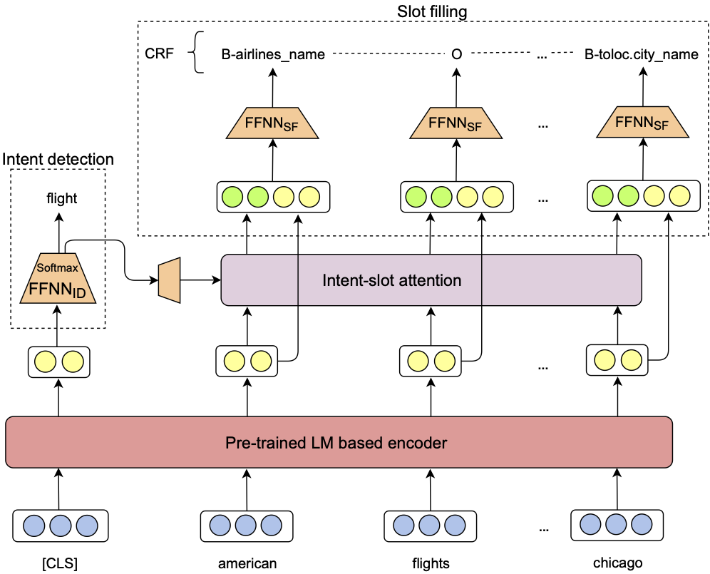

# JointIDSF: Joint intent detection and slot filling

- We propose a joint model (namely, JointIDSF) for intent detection and slot filling, that extends the recent state-of-the-art [JointBERT+CRF](https://arxiv.org/abs/1902.10909) model with an intent-slot attention layer to explicitly incorporate intent context information into slot filling via "soft" intent label embedding.
- We also introduce the first public intent detection and slot filling dataset for Vietnamese.
- Experimental results on our Vietnamese dataset show that our proposed model significantly outperforms JointBERT+CRF.

<p align="center">	

</p>


Details of our JointIDSF model architecture, dataset construction and experimental results can be found in our [following paper](https://arxiv.org/abs/2104.02021):

    @inproceedings{JointIDSF,
        title     = {{Intent Detection and Slot Filling for Vietnamese}},
        author    = {Mai Hoang Dao and Thinh Hung Truong and Dat Quoc Nguyen},
        booktitle = {Proceedings of the 22nd Annual Conference of the International Speech Communication Association (INTERSPEECH)},
        year      = {2021}
    }
**Please CITE** our paper whenever our dataset or model implementation is used to help produce published results or incorporated into other software.

## Dataset

<p align="center">	

</p>

> ***By downloading [our dataset](https://github.com/VinAIResearch/JointIDSF/tree/main/PhoATIS), USER agrees:***
> * to use the dataset for research or educational purposes only.
> * to **not** distribute the dataset or part of the dataset in any original or modified form.
> * and to cite our paper above whenever the dataset is employed to help produce published results.

## Model installation, training and evaluation

### Installation
- Python version >= 3.6
- PyTorch version >= 1.4.0

```
    git clone https://github.com/VinAIResearch/JointIDSF.git
    cd JointIDSF/
    pip3 install -r requirements.txt
```

### Training and Evaluation
Run the following two bash files to reproduce results presented in our paper:
```
    ./run_jointIDSF_PhoBERTencoder.sh
    ./run_jointIDSF_XLM-Rencoder.sh
```

 - Here, in these bash files, we include running scripts to train both our JointIDSF and the baseline JointBERT+CRF.  
 - **Although we conduct experiments using our Vietnamese dataset, the running scripts in `run_jointIDSF_XLM-Rencoder.sh` can adapt for other languages that have gold annotated corpora available for intent detection and slot filling.** Please prepare your data with the same format as in the ```data``` directory.

### Inference
We also provide model checkpoints of JointBERT+CRF and JointIDSF. Please download these checkpoints if you want to make inference on a new text file without training the models from scratch.
 - JointIDSF
 
http://public.vinai.io/JointIDSF_PhoBERTencoder.tar.gz

http://public.vinai.io/JointIDSF_XLM-Rencoder.tar.gz

 - JointBERT+CRF
 
http://public.vinai.io/JointBERT-CRF_PhoBERTencoder.tar.gz

http://public.vinai.io/JointBERT-CRF_XLM-Rencoder.tar.gz

Example of tagging a new text file using JointIDSF model:
```
python3 predict.py  --input_file <path_to_input_file> \
                    --output_file <output_file_name> \
                    --model_dir JointIDSF_XLM-Rencoder
```
where the input file is a raw text file (one utterance per line).

### Acknowledgement
Our code is based on the unofficial implementation of the JointBERT+CRF paper from https://github.com/monologg/JointBERT
