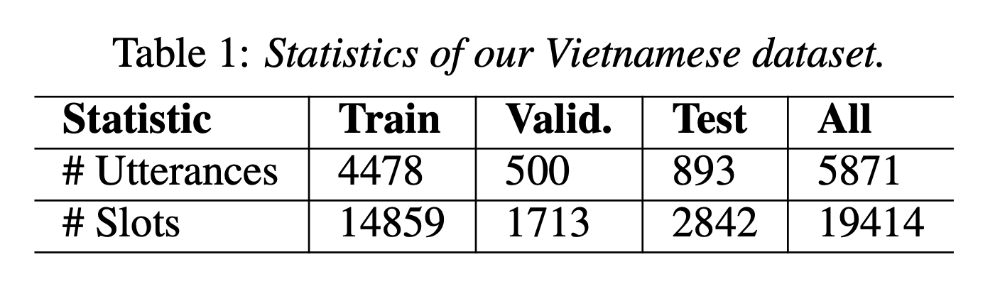

# Intent detection and slot filling for Vietnamese

- In this paper, we present the first public intent detection and slot filling dataset for Vietnamese. 
- In addition, we also propose a joint model for intent detection and slot filling, that extends the recent state-of-the-art JointBERT+CRF model with an intent-slot attention layer in order to explicitly incorporate intent context information into slot filling via "soft" intent label embedding. 
- Experimental results on our Vietnamese dataset show that our proposed model significantly outperforms [JointBERT+CRF](https://arxiv.org/abs/1902.10909).

<p align="center">	

</p>


Details of our dataset construction, JointIDSF model architecture, and experimental results can be found in our [following paper](https://arxiv.org/abs/2104.02021):

    @article{jointidsf,
    title     = {{Intent detection and slot filling for Vietnamese}},
    author    = {Mai Hoang Dao, Thinh Hung Truong, Dat Quoc Nguyen},
    journal   = {arXiv preprint},
    year      = {2021}
    volume    = {arXiv:2104.02021}
    }

**Please CITE** our paper whenever our dataset or model implementation is used to help produce published results or incorporated into other software.

## Dataset
- Our dataset, which is the first public dataset for Vietnamese intent detection and slot filling is provided under the `data/` directory. 
- In particular, we provide two versions coresponding to the syllable-level and word-level dataset.
- Our dataset can be seen as a Vietnamese version of the widely-used ATIS dataset. In addition to translation, we also make modification where possible to ensure that the Vietnamese utterances are natural, fitting in real-world scenarios of flight booking in Vietnam, and of high-quality.

<p align="center">	

</p>


By downloading our dataset, USER agrees:

- to use the dataset for research or educational purposes only.
- to **not** distribute the dataset or part of the dataset in any original or modified form.
- and to cite our paper above whenever the dataset is employed to help produce published results.

## Installation
- Python version >= 3.6; PyTorch version >= 1.4.0
```
    git clone https://github.com/VinAIResearch/JointIDSF.git
    cd JointIDSF/
    pip install -r requirements.txt
```


## Training and Evaluation
To reproduce the results in the paper please run (in the following order)
```
    ./run_jointBERT_PhoBERTencoder.sh
    ./run_jointIDSF_PhoBERTencoder.sh
    ./run_jointBERT_XLM-Rencoder.sh
    ./run_jointIDSF_XLM-Rencoder.sh
```
Note that we initialize JointIDSF from JointBERT so in order to execute the command ```./run_jointIDSF_PhoBERTencoder.sh``` (or ```./run_jointIDSF_XLM-Rencoder.sh```), user need to run ```./run_jointBERT_PhoBERTencoder.sh```(or ```./run_jointBERT_XLM-Rencoder.sh```) first.

Example usage:
```
python3 main.py --task word-level \
                  --model_type phobert \
                  --model_dir ./JointBERT_PhoBERTencoder/ \
                  --data_dir data \
                  --seed 1 \
                  --do_train \
                  --do_eval \
                  --save_steps 140 \
                  --logging_steps 140 \
                  --num_train_epochs 50 \
                  --tuning_metric mean_intent_slot \
                  --use_crf \
                  --token_level word \
                  --embedding_type soft \
                  --intent_loss_coef 0.6 \
                  --learning_rate 3e-5
```
## Inference
To tag a raw text file:
```
python3 predict.py  --input_file <input_file_name> \
                    --output_file <output_file_name> \
                    --model_dir <path_to_trained_model>
```

## Use your own dataset
- Our model can also be applied to other dataset. Please prepare your data with the same format as in the ```data/``` directory

#### Copyright (c) 2021 VinAI Research

	THE DATA IS PROVIDED "AS IS", WITHOUT WARRANTY OF ANY KIND, EXPRESS OR
	IMPLIED, INCLUDING BUT NOT LIMITED TO THE WARRANTIES OF MERCHANTABILITY,
	FITNESS FOR A PARTICULAR PURPOSE AND NONINFRINGEMENT. IN NO EVENT SHALL THE
	AUTHORS OR COPYRIGHT HOLDERS BE LIABLE FOR ANY CLAIM, DAMAGES OR OTHER
	LIABILITY, WHETHER IN AN ACTION OF CONTRACT, TORT OR OTHERWISE, ARISING FROM,
	OUT OF OR IN CONNECTION WITH THE DATA OR THE USE OR OTHER DEALINGS IN THE
	DATA.

