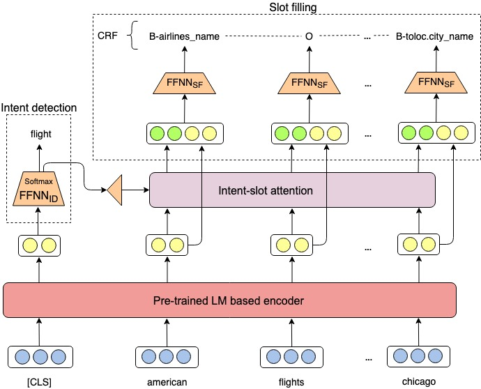

# Intent detection and slot filling for Vietnamese

In this paper, we have presented the first public dataset for Vietnamese intent detection and slot filling. In addition, we also have proposed an effective model, namely JointIDSF, for jointly learning intent detection and slot filling. In particular, JointIDSF extends the recent state-of-the-art [JointBERT+CRF](https://arxiv.org/abs/1902.10909) by introducing the intent-slot attention layer to incorporate intent context information into slot filling explicitly. We empirically conduct experiments and perform a detailed error analysis on our dataset, and show that: JointIDSF significantly outperforms JointBERT+CRF and our attention mechanism is more effective than the previous ones.

<p align="center">	

</p>


Details of our dataset construction, JointIDSF model architecture, and experimental results can be found in our [following paper](https://arxiv.org/abs/2104.02021):

    @article{jointidsf,
    title     = {{Intent detection and slot filling for Vietnamese}},
    author    = {Mai Hoang Dao, Thinh Hung Truong, Dat Quoc Nguyen},
    journal   = {arXiv preprint},
    year      = {2021}
    volume    = {arXiv:2104.02021}
    }

**Please CITE** our paper whenever our dataset or model implementation is used to help produce published results or incorporated into other software.

## Installation
- Python version >= 3.6; PyTorch version >= 1.4.0
```
    git clone https://github.com/VinAIResearch/JointIDSF.git
    cd JointIDSF/
    pip install -r requirements.txt
```


## Training and Evaluation
To reproduce the results in the paper please run
```
    run_phobert_crf.sh
    run_phobert_crf_attn.sh
    run_xlmr_crf.sh
    run_xlmr_crf_attn.sh
```
Example usage:
```
python3 main.py --task word-level \
                  --model_type phobert \
                  --model_dir ./phobert_crf/ \
                  --data_dir data \
                  --seed 1 \
                  --do_train \
                  --do_eval \
                  --save_steps 140 \
                  --logging_steps 140 \
                  --num_train_epochs 50 \
                  --tuning_metric mean_intent_slot \
                  --use_crf \
                  --token_level word \
                  --embedding_type soft \
                  --intent_loss_coef 0.6 \
                  --learning_rate 3e-5
```

## Dataset
Our dataset, which is first public dataset for Vietnamese intent detection and slot filling is under the `data/` directory. In particular, we provide two versions coresponding to the syllable-level and word-level dataset.

By downloading our dataset, USER agrees:

- to use the dataset for research or educational purposes only.
- to **not** distribute the dataset or part of the dataset in any original or modified form.
- and to cite our paper above whenever the dataset is employed to help produce published results.

#### Copyright (c) 2021 VinAI Research

	THE DATA IS PROVIDED "AS IS", WITHOUT WARRANTY OF ANY KIND, EXPRESS OR
	IMPLIED, INCLUDING BUT NOT LIMITED TO THE WARRANTIES OF MERCHANTABILITY,
	FITNESS FOR A PARTICULAR PURPOSE AND NONINFRINGEMENT. IN NO EVENT SHALL THE
	AUTHORS OR COPYRIGHT HOLDERS BE LIABLE FOR ANY CLAIM, DAMAGES OR OTHER
	LIABILITY, WHETHER IN AN ACTION OF CONTRACT, TORT OR OTHERWISE, ARISING FROM,
	OUT OF OR IN CONNECTION WITH THE DATA OR THE USE OR OTHER DEALINGS IN THE
	DATA.

